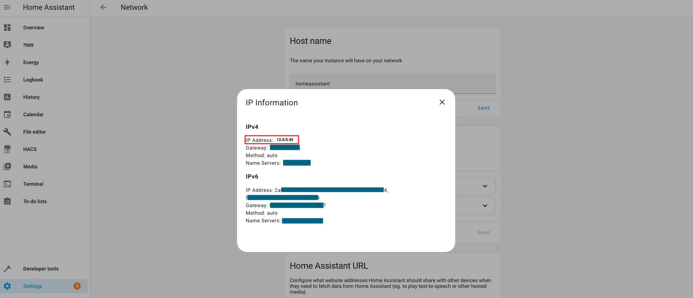
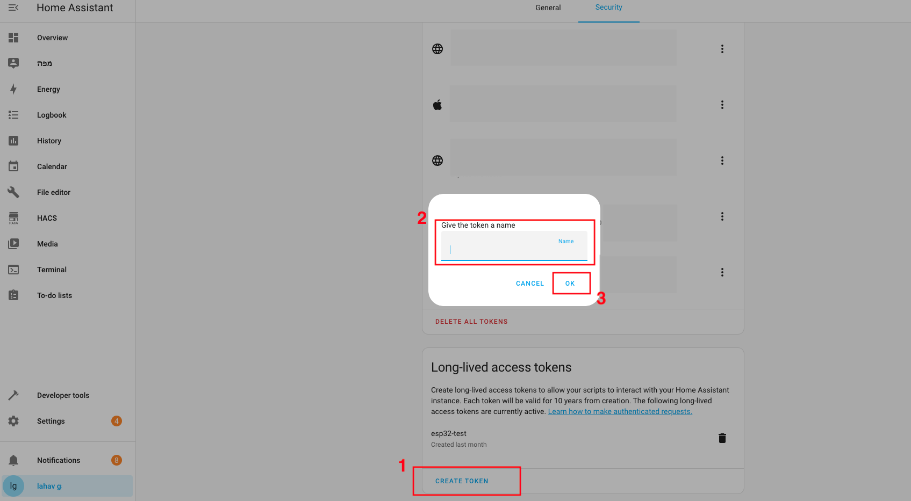

# ESP32 Home Assistant To-Do List

## Description

This project allows an ESP32 to connect to **Home Assistant** and display or manage tasks from a **To-Do List**. The ESP32 can:
- Display tasks.
- Update tasks.
- Add new tasks.
- Delete tasks.

The project can be extended to work with **Microsoft To-Do Lists** (optional). For this integration, see the links provided.

## Features

- Fetch and display tasks from a Home Assistant To-Do list.
- Add, update, and remove tasks using a Serial interface.
- Proof of concept – customizable for different displays and interfaces.

---

## Optional Integration with Microsoft To-Do

If you want to integrate **Microsoft To-Do** with Home Assistant, follow this guide (not mandatory for this project):

- **Video Guide**: [YouTube Video](https://www.youtube.com/watch?v=yKr5nMzOaAI&list=PLaAFohuekyP9xO9LnWHPF5wtZy9AN1rLI&index=10)
- **GitHub Repository**: [O365-HomeAssistant](https://github.com/RogerSelwyn/O365-HomeAssistant)

⚠️ **Credits**: The above resources are not part of this code and belong to their respective creators.

---

## Requirements

### Hardware

- ESP32 board

### Software

- Arduino IDE
- Home Assistant with To-Do List integration

---

## Configuration Steps

### Step 1: Access Home Assistant Locally

You can access Home Assistant locally by visiting:  
[http://homeassistant.local:8123](http://homeassistant.local:8123)

Alternatively, use your local IP address, for example:  
`http://12.0.0.34:8123`

If you know the IP, **skip Step 2** and go to **Step 3**.

---

### Step 2: Find Your Home Assistant IP Address

1. Open **Home Assistant**.
2. Go to:  
   **Settings** → **System** → **Network** → **Configure network interfaces** (three dots).

Copy the **IPv4 Address**. For example: `12.0.0.34`.



---

### Step 3: Create an API Token in Home Assistant

1. Go to **Profile** in Home Assistant.
2. Move from **general** to **security**. [link](http://homeassistant.local:8123/profile/security)
4. Scroll down to **Long-Lived Access Tokens**.
5. Click **Create Token** and give it a name (e.g., `esp-todo-accessToken`).
6. Copy the token and **save it** securely (you won’t see it again).

⚠️ **Important**: If you lose the token, you’ll need to create a new one.



---

### Step 4: Update `config.cpp`

Open `config.cpp` and update the following fields with your details:

```cpp
// Wi-Fi Credentials
const char *ssid = "Your_SSID";
const char *password = "Your_Password";

// Home Assistant API details
const String baseURL = "http://<Your_Home_Assistant_IP>:8123/api/";
const String listName = "<Your_Todo_List_Entity_ID>";
const String accessToken = "<Your_Access_Token>";
```

Example values:

```cpp
// Wi-Fi Credentials
const char *ssid = "network_name";
const char *password = "123456789";

// Home Assistant API details
const String baseURL = "http://12.0.0.34:8123/api/";
const String listName = "todo.tasks_hass_account";
const String accessToken = "1skF2sdfghjklkjhgfdfYHdHYmE";
```

### Step 5: Upload the Code
1. Open esp32-home-assistant-todo-list.ino in Arduino IDE.
2. Connect your ESP32 to the computer.
3. Select the correct Board and Port in the Arduino IDE.
4. Click Upload.

### Step 6: Run and Interact
Open the Serial Monitor (set to 115200 baud).
Use the menu to:
Display tasks.
Update tasks.
Add tasks.
Delete tasks.

Example menu in Serial Monitor:
```
--- To-Do List Menu ---
1. Display To-Do Items
2. Update a To-Do Item
3. Add a New To-Do Item
4. Remove a To-Do Item
Enter your choice (1-4):
```
---

## Notes

- This project is a **proof of concept**. Feel free to customize it to your needs.
- For example, you can create a graphical interface using an **ESP32 with a display module** (like **esp32 2432s028**, which is very cheap).
- Don’t forget to **credit** the original code if you share your project.
